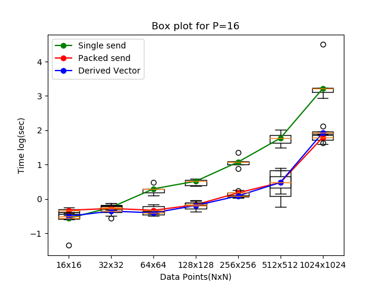
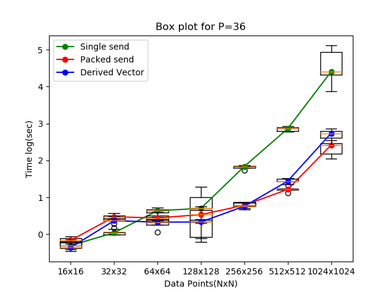
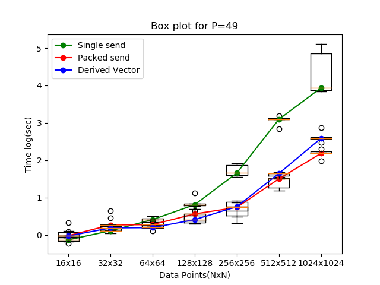
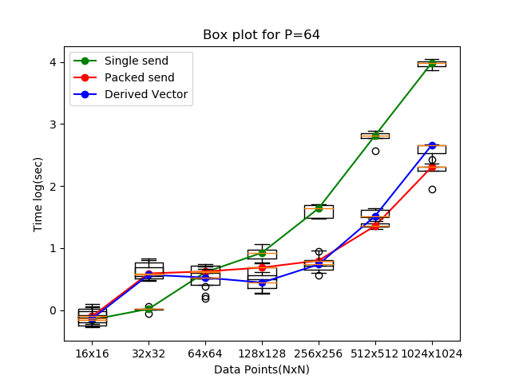

 # ParallelComputing

# Assignment 1

* The main script is run.py and run.sh will run all the nessesary scripts | cmd: ./run.sh
* All ploting functions are written into another script plot.py, 
* Might need to recompile the src.c with make command **if errors come**,
* Output of the program is stored in data.txt,  
* data.txt holds the time(sec) taken by each configration for each iterative runs of the program.
* plot16.png, plot32.png , plot49.png and plot64.png is resultant box plot graph generated by plot.py.
* Box plot is plotted in log scale | log(sec),
* checkhosts.sh script checks the available hosts in the cluster for running the program.

## Observation

* Mostly run time is increasing with the size of data we are sending,
* Run time for single send is greater than Packed and Vector,
* After N(data point) = 256 we can see significant time difference between Single send and Packed, Vector send, 
* Run time for Packed and Vector is approximately same.

## Code Explaination
* Store the boundary data of array in 4 arrays up, down, left and right for communication,

* MPI_PACK
    * send up, down, left and right to parallel processes
    * store in up/down/left/right array via MPI_PACK,
    * send data by MPI_Isend,
    * recieve data in via MPI_Recv and store in recv_up,recv_down,recv_left and recv_right,
    * complete computation using these value,
    * update the value of main array and again repeat untill 50<num_steps>.

* MPI_Vector
    * For Vector create a new vector of array lenth,
    * data store in vector and then send to parallel processes,
    * rest same as above.

* For Single send, 
    * use a for loop for sending data multiple times,
    * rest is same as above.

## Box Plots

## Authors

* **Deepesh Chaudhari** - - [deepeshchaudhari](https://github.com/deepeshchaudhari)
