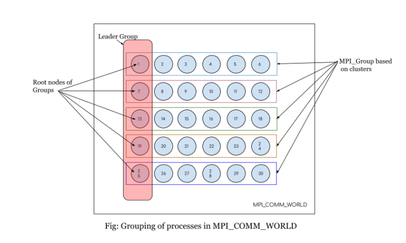
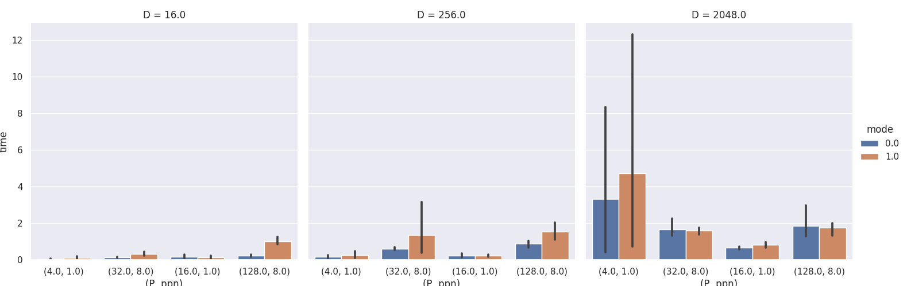
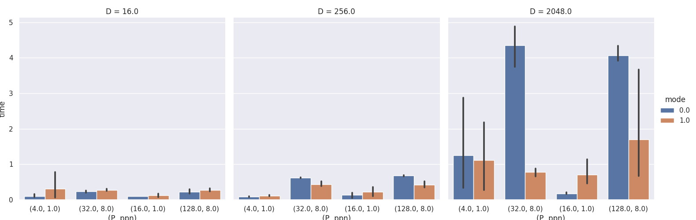
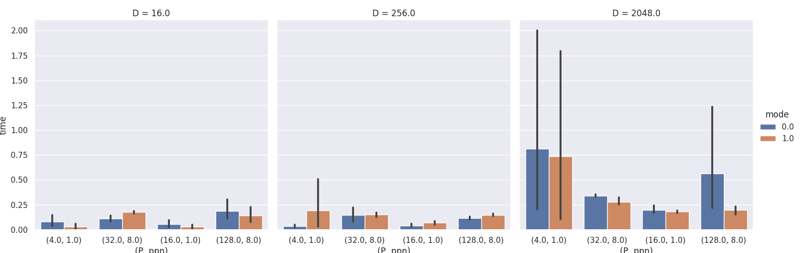
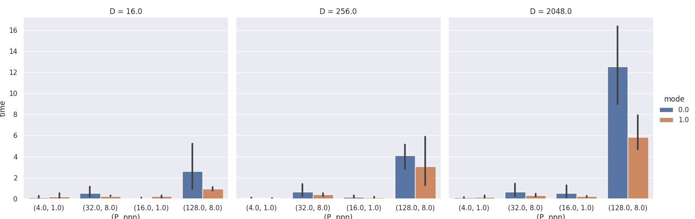

 # ParallelComputing

# Assignment 2 : Optimization of Collectives

## Execution command

* To execute program run **bash run.sh** or **./run.sh**
* run.sh script compile **src.c** file generate an src.o object file,
* then it generate the **hostfile** as per the requirement of the iteration,
* then execute the program according to assignment (**note** : if any error come in any itertation, script automatically redo that iteration; no need to stop prosess),
* after successfull execution of program,it generates **data.txt** which hold all the output,
* then **plot.py** generates barplot using data.txt file.

## Observation

* In optimization of MPI_Bcast some times its giving better results, sometimes its taking more time than normal Bcast, in submitted plot we can see that sometimes optimized bcast is taking more time than normal Bcast.
* In optimization of MPI_Reduce for small data it shows very little difference in time, where as in medium and large data we can see a significant difference in time, we are getting best performance in Reduce for large data.
* In optimization of MPI_Gather for small and medium size data, we can see a little difference in time, where as in large data Gather is giving better performance.
* Alltoallv and Optimized Alltoallv is taking approx similiar time for small, medium and large.

## Solution logic and Code Explaination

* In the CSE cluster, there are 6 node groups with **Intra-group** distance as 2 and **Inter-group** distance as 4. Thus, a group aware communication can be an area of optimization. In order to achieve that we associate the nodes belonging to same group and do Intra-group communication within the same group. We pick one node per group for doing inter-group communications and call them leader nodes.
* Only these leader nodes handle the inter-group communitcaion. So, we have 2 communicators - one for inter group communication( within leaders), and other for intra-group communication. Following figure shows the group breakdown for **6 x 5** processes where No of groups is 4 and process per group is 6. We choose the leader based on ROOT where ROOT is a node that wants to send data to all other nodes. The offset of ROOT from the first element of the group is used to select group leaders in other groups.
* In case of default functionality of Collective calls i.e, **MPI_Bcast**, **MPI_Gather** etc, the ROOT node directly sends the message in the **MPI_COMM_WORLD** and the optimizations are handled by MPI library without taking into consideration of the network topology. We tried to bring network topology aware collective calls through this assignment.

* For this inter and intra-group communication, we are **dynamically** checking all the process allocation on the node and then generating different cluster groups and in every cluster assigning one node as a leader. 

* Following figure give you an idea of how **virtual topology** of **cluster** and **leader group** ...

<!--  -->

  

* **MPI_Bcast Optimization**
    * For Bcast optimization, first I generate different group & there communicators and then assign each group a leader and then make a group of leader,
    * First we broadcast data in leader's group and then leaders broadcast that data to their corresponding group,
    * I first try scatter and then allgather for Bcast but it didn't optimized much.
    
* **MPI_Reduce Optimization**
	* For optimization of Reduce, I did opposite of Bcast here,
	* First I Reduce data in individual group level to their corresponding leader node.
	* Then leader's group Reduce data in their group and then at root node of leader's group overall reduced data calculated and collected,
	* I used **MPI_SUM** for reduce function.
    
* **MPI_Gather Optimization** 
	* Optimization of Gather is bit similiar to Reduce,
	* First I Gather all data in individual groups to their leader node,
	* Then leader group Gather all data and then at root node of leader overall gathersd all data.

* **MPI_Alltoallv Optimization**
	* For optimization of MPI_Alltoallv, 
	* First generate different group and and assign a leader to each group,
	* then do alltoallv in each group then leaders have all group data,
	* then alltoallv in leader group and again do alltoallv in group to collect all data. 

## Box Plots
* **Barplot for Bcast**

* **Barplot for Reduce**

* **Barplot for Gather**

* **Barplot for Alltoallv**

## Authors

* **Deepesh Chaudhari** - - [deepeshchaudhari](https://github.com/deepeshchaudhari)
