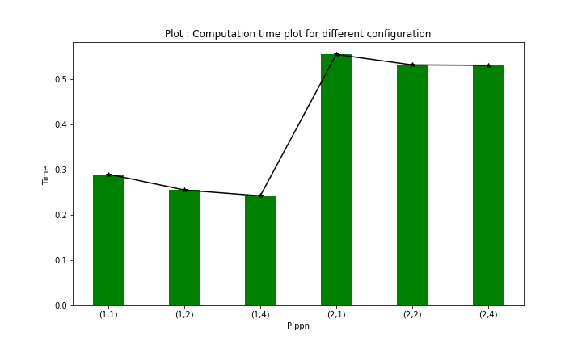

# CS633A : Parallel Computing - Assignment 3

## Deepesh Chaudhari(19111028)          Muzafar Ahmad Wani(20111271)

## Execution command :

* To execute program run **bash run.sh** or **./run.sh**
* run.sh script compile **src.c** file generate an **code.o** object file,
* then it generate the **hostfile** as per the requirement of the iteration,
* then execute the program according to assignment,
* after successfull execution of program,it generates **output.txt** which hold the output and **time_data.txt** which hold computation time,

## Observation :
* For P=1 and P=2, there was a slight decrease in running time as PPN increased, this
is most likely because the amount of communication between physical processors is the
same, as P is same but the computation load on each process decreases as PPN increases.

* The running  for P = 2 was much higher than that for P = 1, this is because the communication time is more than computation because it involves transfer of data to every process.  

## Solution logic and Code Explaination

* Program computes the yearly and global minimum values from given data by distributing the entire data between specified number of processes, and gathering the result at the root.
* **Data Distribution Strategy** : For data distribution, we’ve import 2D data and convert it into 1D data, so that we can divide the data such that each process gets an equal numbers of years, on which it has to compute locally. If there are any years left as remainder, then those are handled by the root itself.
* To do this, first we get the total number of years and stations from the data and broadcast it to each process. Using this information we read the file again and store the data in a 1-D buffer in column order such that the data is stored year after year.
* each process computes the yearly minimum values for the data of years that it has been assigned. Then, these results are collected at the root using MPI_Gather.
* Finally, using the collected yearly minimums, the global minimum is calculated at the root,and the yearly minimums, global minimum and the running time are output.

## Plot :

## Authors :

* **Deepesh Chaudhari** - - [deepeshchaudhari](https://github.com/deepeshchaudhari)
* **Muzafar Wani** - - [muzafarwan](https://git.cse.iitk.ac.in/muzafarwan)
